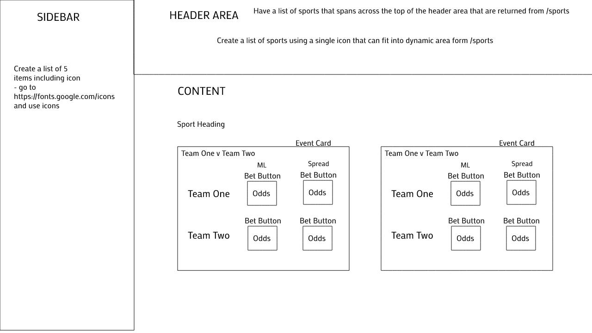

# Recreate a simple Sportsbook Homepage

Note: These are copied from the Vue project so some instructions might not make sense.

Starter project in VueJs for Sportsbook Internship, a very simplified version of the Barstool Sportsbook homepage.

## Starting Project

Before starting:

1. Make sure that you have Node Version Manager installed (NVM) installed: https://github.com/nvm-sh/nvm, and have Node LTS version as your selected version.
2. Make sure that you have Yarn installed: https://yarnpkg.com/
3. Fork Project into your Github
4. Clone onto your computer
5. `npm install` in both the root folder and in the server folder.

In root directory run:

`npm run start:ui`

And in a separate terminal tab run:

`npm run start:server`

_Note: The project is already setup so that Axios will have it's base url set to the server, all endpoints should just be used as `/endpoint`_

## Project Outline

What you'll be aiming to do is to:

1. Create a header which lists out the sports returned from the `/all-sports` endpoint.
2. Create a sidebar with 5 items of your choice - either navigation between pages or a list of sports. Each of these items will have an icon which you can find at [https://fonts.google.com/icons](https://fonts.google.com/icons)
3. Create a main section which will:
  + Have rows of events by Sport
  + Each row will have a series of events
  + Each event will have 2 participants with two buttons each (4 in each event box) displaying their lineage
  + On click this button will submit the specific bet, make sure it includes an object with the keys of `eventId`, `betId`, `teamId` for the specific bet.

## What We'll Be Looking For

1. Follow the Sportsbook Style Guide
2. Clean, readable, testable, and concise code
3. How you handle input on your PRs, and your communication while in pair programming
4. Ability to find answers, and able to reach out for help when needed

## Endpoints

`/all-sports` - returns all sports

`/events` - events with participant ids and betIds for participants

`/bets` - bets with id and lineage

`/teams` - teams with names and ids

`/sports` - sports with name, key, and eventIds for sports

